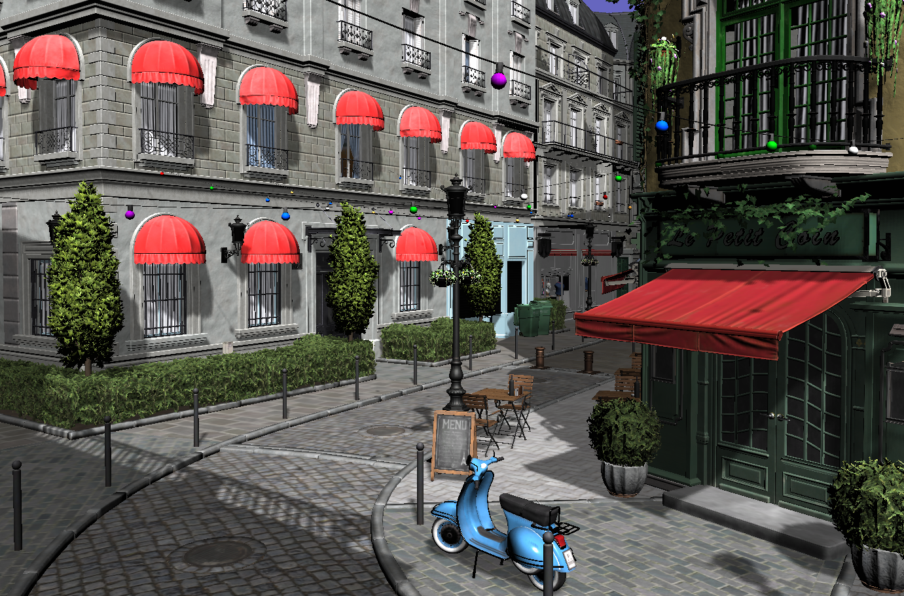

# tp de rendu du Master ID3D de Lyon 1

.

Scène [bistro](https://developer.nvidia.com/orca/amazon-lumberyard-bistro) de Amazon et Nvidia

- Basé sur https://perso.univ-lyon1.fr/jean-claude.iehl/Public/educ/M1IMAGE/html/index.html

- Et sur les cours de https://perso.univ-lyon1.fr/jean-claude.iehl/Public/educ/M2PROIMA/index.html

## Les TPs

Les fichiers des tps sont dans projets/***

### TP SI3D

- Dans projets/tp, tp sur les bases du rendu openGL avec le frustum culling, le shadow mapping et le rendu de scène (Il manque les scènes d'illustrations qui sont trop grosse pour github)
- Dans projets/tpRtx, tp sur les bases du lancer de rayons

### TP GPU

- Dans projets/tpCompute tp sur les compute shaders. (WIP)
